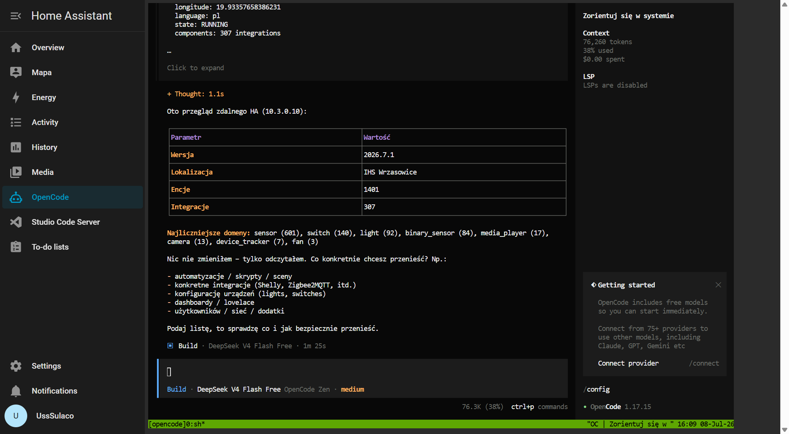

# ha-opencode – OpenCode Terminal for Home Assistant

[](https://github.com/ussdeveloper/ha-opencode)
[](https://github.com/ussdeveloper/ha-opencode)
[](https://github.com/ussdeveloper/ha-opencode)

<p align="center">
  
</p>

**AI-powered terminal for Home Assistant** – full dev environment with OpenCode AI coding agent, available as an add-on in the sidebar panel. Unrestricted host access, SSH, add-on management, and more.

## What it does

- Runs a **web terminal** (ttyd) accessible via the Home Assistant sidebar
- Includes a **full toolset**: bash, git, python3, nodejs, docker-cli, vim, tmux, jq, htop, ripgrep, fd and more
- **Auto-starts OpenCode AI** in a tmux session — connects to it automatically on every terminal open
- **Configurable system prompt, rules, and instructions** for OpenCode via add-on options
- Provides **direct access** to:
  - `/config` — Home Assistant configuration (read-write)
  - `/var/run/docker.sock` — manage add-on containers
  - Supervisor API — restart, logs, config check
  - `/share`, `/backup`, `/media`, `/ssl`, `/addons`

## Quick start

### Add repository

1. In Home Assistant, go to **Settings → Add-ons → Add-on Store**
2. Click ⋮ → **Repositories**
3. Add: `https://github.com/ussdeveloper/ha-opencode`
4. Refresh, find **OpenCode Terminal**, and click **Install**

### Configuration

```yaml
terminal_password: ""          # Terminal password (optional, basic auth)
opencode_auto_start: true      # Auto-start OpenCode on boot
opencode_workspace: "/config"   # OpenCode working directory
opencode_model: ""             # AI model (empty = default)

# ── OpenCode AI customization ────────────────────────────────
opencode_system_prompt: ""     # Custom system prompt for OpenCode
opencode_rules: ""             # Custom rules (written as AGENTS.md)
opencode_instructions: ""      # Additional custom instructions
```

#### Customizing OpenCode behavior

You can customize how OpenCode behaves directly from the add-on configuration:

- **`opencode_system_prompt`** – overrides the default system prompt. Example:
  ```yaml
  opencode_system_prompt: |
    You are a Home Assistant expert. Always prefer YAML configuration.
    When editing automations, use modern HA syntax (triggers/conditions/actions).
  ```

- **`opencode_rules`** – project rules (auto-discovered by OpenCode as `AGENTS.md`). Example:
  ```yaml
  opencode_rules: |
    - Always backup configuration.yaml before editing
    - Use ha-cli check after every config change
    - Follow Home Assistant best practices for YAML structure
  ```

- **`opencode_instructions`** – additional custom instructions loaded by OpenCode:
  ```yaml
  opencode_instructions: |
    This is a smart home configuration.
    Do not modify add-on configurations directly.
    Always validate YAML syntax before suggesting changes.
  ```

These files are generated at startup in `~/.config/opencode/` inside the container and take effect immediately when OpenCode launches.

## Usage

Once installed, the add-on appears as **OpenCode** in the Home Assistant sidebar.

### Web terminal
Click the **OpenCode** panel — a terminal opens directly attached to the OpenCode tmux session with `opencode --continue` running.

### OpenCode AI
- Opens automatically when you connect — just start typing prompts
- `Ctrl+B` then `D` to detach (OpenCode keeps running)
- `oca` or `opencode-attach` to reattach later
- If OpenCode exits, it auto-restarts in the tmux session

### Useful commands
```bash
ha-cli check          # Validate configuration.yaml
ha-cli restart        # Restart Home Assistant core
ha-cli logs           # Tail Home Assistant logs
ha-cli backup         # Backup /config to /backup
ha-cli docker-ps      # List add-on containers
ha-cli exec <name>    # Exec into an add-on container
backup-config         # Backup configuration.yaml before editing
```

## How it works

```
┌─────────────────────────────────────────────┐
│              Home Assistant OS              │
│  ┌───────────────────────────────────────┐  │
│  │        ha-opencode container          │  │
│  │                                       │  │
│  │  ttyd (port 7681)                     │  │
│  │    │                                  │  │
│  │    ▼                                  │  │
│  │  opencode-terminal.sh                 │  │
│  │    │                                  │  │
│  │    ▼                                  │  │
│  │  tmux session "opencode"              │  │
│  │    └─ opencode --continue             │  │
│  │                                       │  │
│  │  Mounts:                              │  │
│  │    /config ← HA config (rw)           │  │
│  │    /var/run/docker.sock (rw)          │  │
│  │    Supervisor API                     │  │
│  └───────────────────────────────────────┘  │
└─────────────────────────────────────────────┘
```

## Requirements

- Home Assistant OS or Supervised (with Supervisor)
- Any architecture: `amd64`, `aarch64`, `armv7`, `armhf`

## Security

- Terminal is available through the HA sidebar (ingress) — same authentication as HA
- Optional basic auth password on the terminal
- Docker access limited to the add-on container scope
- `backup-config` script auto-snapshots before editing files

## Tools inside the container

| Category | Tools |
|---|---|
| Shell | bash, bash-completion, tmux |
| Editors | vim, neovim |
| Git | git, git-lfs |
| Python | python3, pip3, homeassistant-cli, pyyaml |
| Node.js | nodejs, npm |
| Docker | docker-cli, docker-compose |
| CLI tools | jq, yq, curl, wget, htop, btop, ncdu, ripgrep, fd, tree |
| Compression | unzip, zip, tar |
| AI | opencode-ai (global npm install) |

## License

MIT
